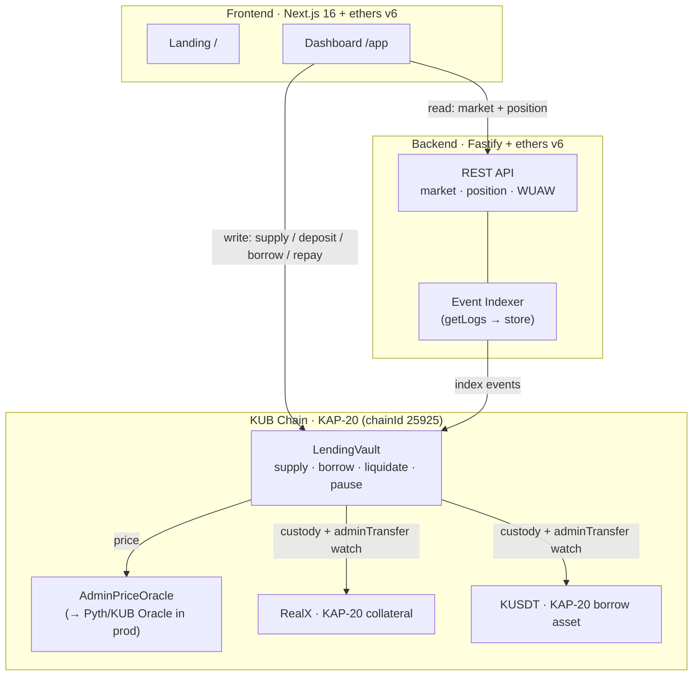

# KBlending

**A two-sided, over-collateralized lending market for KAP-20 assets on KUB Chain — with built-in protection against KAP-20 `adminTransfer` drains.**

Lenders supply a stable asset (KUSDT) and earn interest; borrowers post KAP-20 collateral (e.g. the RealX RWA token) and borrow against it. Interest accrues from utilization, unhealthy positions are liquidated at a discount, and a guardian can pause the market — all standard money-market mechanics. What is **specific to KUB Chain** is the deficit defense described below.

> 🟢 **Live & verified on KUB testnet** — [LendingVault `0xD22A…7d6b`](https://testnet.kubscan.com/address/0xD22A6A0b44fBD34a8a50a502B3E58e7bfCEA7d6b) · full loan lifecycle tested on-chain (see [docs/DEPLOYMENT.md](docs/DEPLOYMENT.md)).

---

## Why this matters for KUB Chain

KAP-20 — Bitkub Chain's token standard — exposes an `adminTransfer` function that lets a token's admin move balances out of **any** address, including a DeFi contract holding that token as collateral or liquidity. That is a structural risk for any lending protocol on KUB Chain, and the reason serious lending has not launched here.

KBlending mirrors, in storage, the token balances it *should* hold (`totalCollateral` for collateral and `borrowCash` for supplied liquidity). Before every user action, the `checkDeficit` modifier compares those figures to the vault's real on-chain balances:

```solidity
modifier checkDeficit() {
    if (collateralToken.balanceOf(address(this)) < totalCollateral) revert DeficitDetected();
    if (borrowToken.balanceOf(address(this)) < borrowCash) revert DeficitDetected();
    _;
}
```

If an `adminTransfer` ever drains the vault, the real balance drops below the internal accounting and the protocol **auto-pauses** — no further deposits, borrows, or withdrawals — freezing positions so remaining depositor funds are protected instead of being drained through a now-broken market. The dashboard surfaces this state prominently. No generic Aave/Compound fork provides this on KAP-20.

## Architecture

Three layers — on-chain contracts, an off-chain indexer/API, and a web client — around a single asset-pair market.



### Contracts

| Contract | Responsibility |
|---|---|
| [`LendingVault`](src/LendingVault.sol) | Two-sided market: supply/withdraw, collateral deposit/withdraw, borrow/repay, interest accrual, liquidation, guardian pause, and the KAP-20 deficit defense. |
| [`IPriceOracle`](src/interfaces/IPriceOracle.sol) | Price-feed interface (USD, 18 decimals) — the seam that lets the oracle be swapped without touching the vault. |
| [`AdminPriceOracle`](src/oracle/AdminPriceOracle.sol) | Owner-settable oracle for testnet; replaced by Pyth / KUB Oracle in production. |
| [`InterestRateModel`](src/interest/InterestRateModel.sol) | Linear utilization-based rate curve (`base + utilization × slope`), unit-tested in isolation. |

### How the money market works

- **Two sides, one pair.** Suppliers deposit `borrowToken` (KUSDT); borrowers deposit `collateralToken` (RealX) and borrow KUSDT. The two roles are independent — a wallet can be either or both.
- **Scaled-balance accounting.** Supply and borrow balances are stored as scaled amounts against a `supplyIndex` / `borrowIndex` (Aave/Compound style). `accrueInterest()` runs at the start of every state-changing call: borrowers' debt grows, suppliers' balance grows, and a `reserveFactor` slice is retained as protocol reserves.
- **Oracle-priced risk.** Borrow power and liquidations are computed in USD value from the oracle. `Health Factor = collateralValue × liquidationThreshold ÷ (borrowValue × 100)`; below `1.0` a position is liquidatable.
- **Liquidations.** A liquidator repays up to the close factor of a bad debt and seizes collateral at an 8% bonus.
- **Two independent safety mechanisms.** A manual guardian `pause()` (OZ `Pausable`) **and** the automatic `checkDeficit` KAP-20 defense described above.

### Risk parameters (MVP)

| Max LTV | Liquidation threshold | Close factor | Liquidation bonus | Base rate | Slope | Reserve factor |
|---|---|---|---|---|---|---|
| 40% | 50% | 50% | 8% | 2%/yr | 20%/yr | 10% |

All rate params are owner-tunable; the LTV constants are fixed. **MVP assumptions:** both tokens use 18 decimals and the oracle returns 18-decimal USD prices.

### Off-chain services

- **Indexer** — back-fills from the vault's deploy block, then polls; parses `Supplied / Borrowed / Repaid / Liquidated / …` events, deduped by `txHash:logIndex`, behind a swappable `EventRepository` (in-memory now, Postgres later).
- **REST API** — `/api/market` (TVL, utilization, APRs), `/api/position/:address`, `/api/stats/wuaw` (**Weekly Unique Active Wallet**, the grant metric, derived purely from on-chain events), `/api/liquidatable`.

## Repo layout

```
src/                 Solidity contracts
test/                Foundry tests (30 tests, ~92% coverage) + test/mocks/MockKAP20.sol
script/Deploy.s.sol  KUB testnet deploy (mock KAP-20 tokens + oracle + vault + seeded liquidity)
backend/             TypeScript · Fastify · ethers — event indexer + REST API
frontend/            Next.js 16 — landing page (/) + lending dashboard (/app)
docs/                Deploy runbook + live deployment record
```

## Smart contracts — build & test

```bash
forge build --sizes
forge test -vvv
forge coverage        # LendingVault ~92% lines
```

## Deploy to KUB testnet

> Full step-by-step (wallet, faucet, wiring) in [docs/DEPLOY_TESTNET.md](docs/DEPLOY_TESTNET.md). Testnet is chainId **25925**.

```bash
cp .env.example .env
# edit .env: set PRIVATE_KEY (testnet only) and KUB_TESTNET_RPC_URL
source .env
# KUB runs a pre-Shanghai EVM (no PUSH0) — foundry.toml pins evm_version = "paris".
# --legacy (no EIP-1559) and --slow (one tx at a time) are also required.
forge script script/Deploy.s.sol:DeployScript \
  --rpc-url kub_testnet --broadcast --legacy --slow -vvv
```

### Deployed & verified (KUB testnet, chainId 25925)

| Contract | Address (verified ✅) |
|---|---|
| LendingVault | [`0xD22A6A0b44fBD34a8a50a502B3E58e7bfCEA7d6b`](https://testnet.kubscan.com/address/0xD22A6A0b44fBD34a8a50a502B3E58e7bfCEA7d6b) |
| RealX (collateral) | [`0x282b9c2ca4416bc4e9d040fFADa1D693D0257ac2`](https://testnet.kubscan.com/address/0x282b9c2ca4416bc4e9d040fFADa1D693D0257ac2) |
| KUSDT (borrow) | [`0x0a9Fbb2DcB37A6Be5d451eB7BB60750dBE2010Bb`](https://testnet.kubscan.com/address/0x0a9Fbb2DcB37A6Be5d451eB7BB60750dBE2010Bb) |
| AdminPriceOracle | [`0x488da9E3F64c0088774C2d54e2B4A5cf35F96591`](https://testnet.kubscan.com/address/0x488da9E3F64c0088774C2d54e2B4A5cf35F96591) |

All four are source-verified on KUBScan. Deployed at block ~31,804,670; 100,000 KUSDT seeded as initial liquidity.

```bash
# verification command (Blockscout-based explorer)
forge verify-contract <ADDR> src/LendingVault.sol:LendingVault \
  --chain-id 25925 --verifier blockscout --verifier-url https://testnet.kubscan.com/api
```

## Backend — indexer + REST API

```bash
cd backend
npm install
cp .env.example .env           # set RPC_URL, VAULT_ADDRESS, COLLATERAL/BORROW_ADDRESS, START_BLOCK
npm run dev                    # http://localhost:4000
npm test                       # stats/WUAW unit tests
```

See [backend/README.md](backend/README.md) for the endpoint list.

## Frontend — landing + dashboard

Next.js 16 + ethers v6. `/` is the marketing landing (KUB green + celeste); `/app` is the lending dashboard, which connects an injected EVM wallet on KUB testnet — a Bitkub NEXT (custodial) connector is scaffolded behind env flags for once a NEXT dApp is registered.

```bash
cd frontend
npm install
cp .env.example .env.local     # fill NEXT_PUBLIC_* with the deployed addresses
npm run dev                    # http://localhost:3000  (/ landing, /app dashboard)
npm run build                  # production build
```

Deploy on Vercel: import the repo, set `frontend` as the project root, add the `NEXT_PUBLIC_*` env vars, deploy.

## End-to-end demo (what to show reviewers)

1. **Two-sided market:** supply KUSDT → deposit RealX collateral → borrow KUSDT → let time pass and watch debt grow and the supplier's balance earn interest.
2. **Liquidation:** lower the RealX price in the oracle to push a Health Factor below 1 → any account calls `liquidate` and seizes collateral at the 8% bonus.
3. **KAP-20 defense:** call `adminTransfer` on the mock token to drain the vault → the dashboard shows the **deficit banner** and every user action reverts.

## Roadmap

- **M1** — mainnet launch, dashboard, aggregator listings, the deficit defense (shipped on testnet).
- **M2** — `AuctionLiquidator` (Dutch/OTC) evolving the current liquidation; monthly reporting.
- **M3** — multi-collateral support; third-party security audit.
- **M4** — referral/partner program; on-chain analytics (subgraph/indexer).

## Security notes

Grant-stage MVP code — **not** audited (audit is milestone 3). Do not use with real funds until audited. The oracle is owner-controlled on testnet by design.

## License

MIT.
